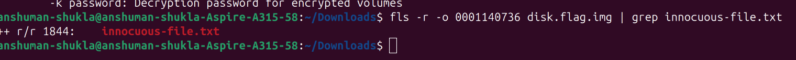
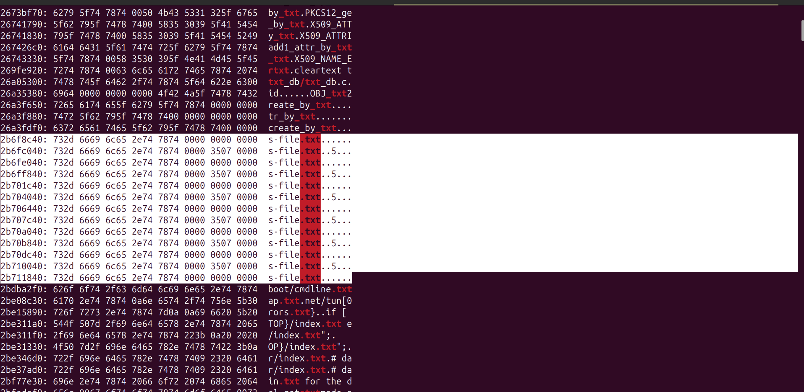

# Dear Diary Challenge

## **Flag**: picoCTF{1_533_n4m35_80d24b30}

So I began by extracting the file, create a loop device and mounting the two partitions (except the swap partition). Analysed different folders and there was just one file worth considering, at least from what i saw: `innocuous-file.txt`. Sounds suspicious but the size of the file itself was 0, there was nothing in it. Now, I dont know much about analysing disk images so I headed over to chatgpt, it gave me some commands and things to look at including converting different files like the sh, this txt and the no names or whatever file to hexdump and grep for pico, nothing. Then did the same for other folders, other partition. PAINFUL process. I spent so much time doing this f*c*k*n* hell. I'm probably not gonna pick forensics as my sub-domain. It is cool to know and play around but gets painful sometimes. After going through god knows how many commands I still came up with nothing. Used `icat` and other disk forensic analysis tools. Then chatgpt suggested using autopsy. First had quite the trouble installing it, then found it was already on the snap store lol. Used it to search for keyword pico in the binary of the file, nothing, txt, and in the hex dump of each instance was 'pic' next instance was "{" and so on. The flag wasn't in the files, it was around them. What a genius idea. But still i wanted to find a way to do this in terminal itself. I did multiple instanced of "innocuous" upon grepping it in the binary of the disk image itself. I also got some text files, but when those text files appeared "innocuous" did not, and vice versa. Its weird. Also I ran into problems mounting the partition even though i already did it once, so i had to repair it and then it worked. Again, no clue why that happened. I couldn't do it in terminal. The inode of the innocuous file `1844` gave me nothing back when displaying it with context of 10 lines above and below it. It kept giving an offset error which as far as i know was correct. At this point, it was too much and I anyways had the flag so I did not continue. Forensics is a challenge for sure, its love-hate. 

