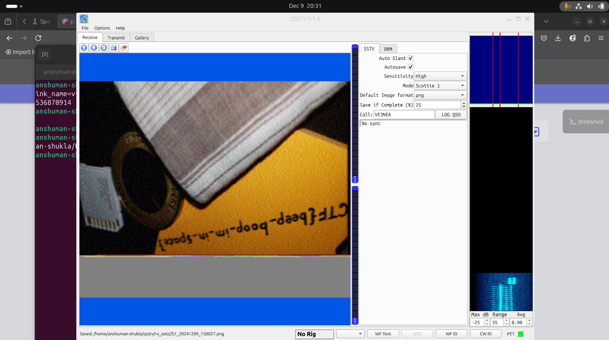

# m00nwalk Challenge
## **FLAG**: picoCTF{beep_boom_im_in_space}

Another interesting challenge. Googling Hint 1 suggessted the method of trasnmission was SSTV (which was a rabbit hole in itself since I'm quite an astronerd). Had great time learning about SSTV and other transmission methods used in the Apollo missions. This is also widely used by the HAM community, of which I'm a licensed operator. Such stuff is so fascinating. Had fun looking at how people integrate it with their custom HAMs to obtain downlink from the ISS. Anyways, Back to the challenge. 

Hint 2, Scotty the CMU mascot. Turns out SSTV decoding has various formats, one of which is the Scottie format. Went ahead and installed QSSTV for linux. This was a pain in itself. The original links are down for some reason so had to dig and found the guix package installer with qsstv available. Tried to get it to work but didn't. Searched more and found a newer version. Installed but again, audio source issues. Tried Robot36 app on android too but didn't work for some reason. Watched videos and chatGPT to understand I needed to create a virtual cable channel and play the wav in that channel which would be taken as input to QSSTV. Followed the instructions. It worked!

Another interesting this is the callsign (Call: VE3NEA) in the image. A QRZCQ lookup tells this callsign belongs to Alex Shovkoplyas, the creator of CW Skimmer, a popular multi-channel morse decoder encoder for Windows. Nice. 
