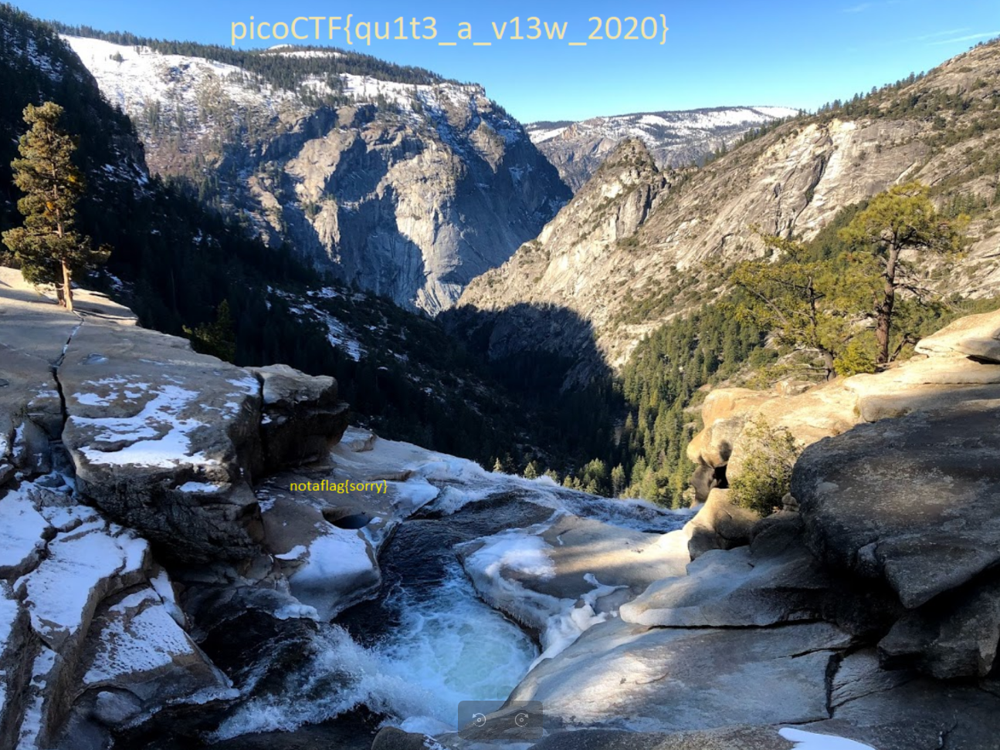

# tunn3l_v1s10n Challenge

Flag: `picoCTF{qu1t3_a_v13w_2020}`

## Challenge Summary:
I opened the file and got the error message: "BMP image has unsupported header size". Welp, it is a BMP image and something to do with headers. Where have we done that before? 

Checked the metadata EXIF tags using an online tool and confirmed it is a BMP image with a resolution of 1134x306. Looked up BMP header tags and found this [link](http://www.ece.ualberta.ca/~elliott/ee552/studentAppNotes/2003_w/misc/bmp_file_format/bmp_file_format.htm). Understood how these headers typically look like and their byte sizes. Downloaded a reference BMP image from [this link](https://filesamples.com/formats/bmp) to analyze headers on hexed.it. 

Based on the given info, the size of the given image should be 29,614 bytes. But the offset for when the data begins is given as BA D0 00 00 which would mean data begins after 54,730 bytes (obviously impossible). Typical offset is 14+40 bytes for Header and InfoHeader. Corrected to 34 00 00 00, then 28 00 00 00 for the size of info header. The width should be 66 04 00 00, whereas it is given as 6E 04 00 00. The Height is correctly given as 32 01 00 00, but it doesn't work. Changing these values does change the view, so it's got to do with the resolution now (the given resolution could be incorrect). 1134*306 = 347004*3 = 1,041,012 bytes (height*width*3 bytes per pixel) whereas the file size is actually 2,893,454 bytes as per hexed.it. 2893454/3 = 964484, which is the width by height value we need. 1100 by 876 gives this value roughly, but didn't work in the header. Tried changing multiple values but the only value displaying anything but static was the original height values of 6e 04, so kept that and made the height 876 i.e. 6C 03 and it worked!

